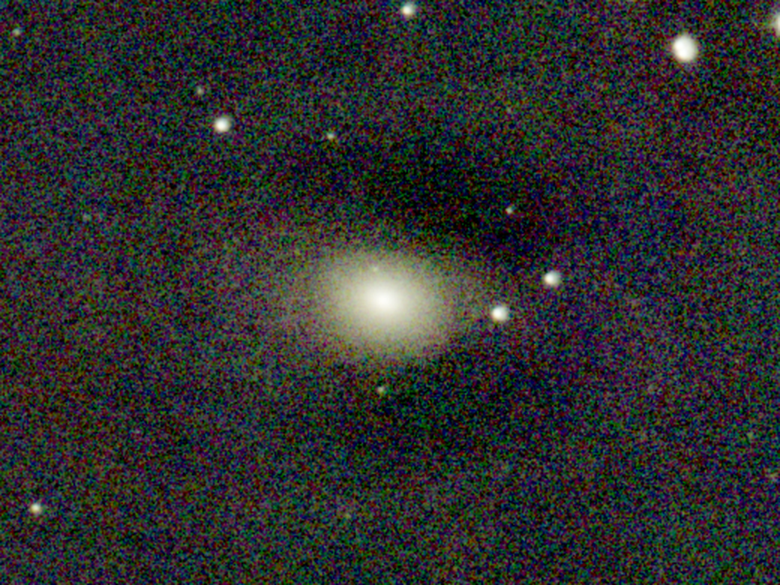
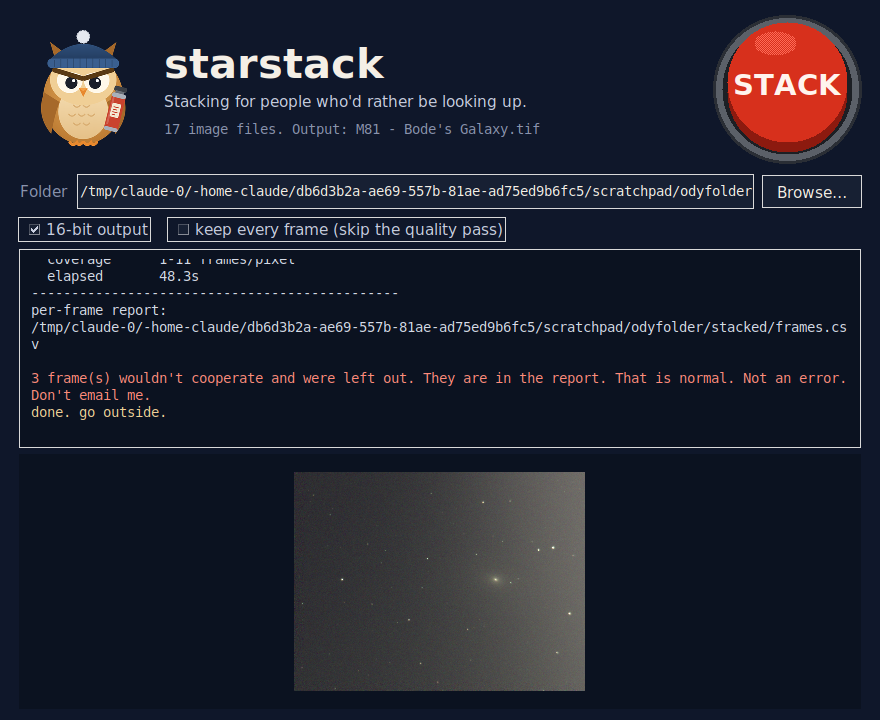
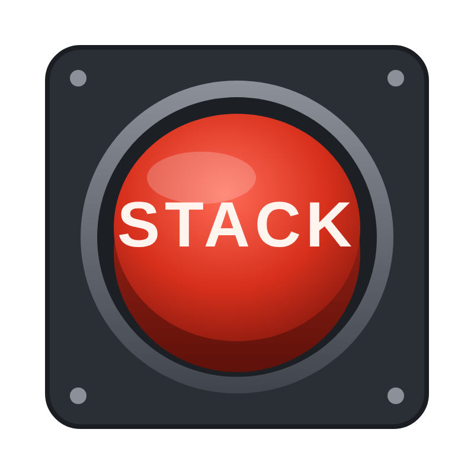

<p align="center">
  
</p>

<p align="center">
  <a href="https://github.com/kylefoxaustin/starstack/actions/workflows/ci.yml"></a>
  
  
</p>

Dump a folder of frames in. Push one button. Get a stacked image out.

```
pip install -r requirements.txt
python starstack.py /path/to/frames -o result.tif --preview look.png
```

That's it. That's the workflow. No sequence files, no process folder, no
"register first, then stack", no state left on disk, no forum thread.

Don't like terminals? **Drag the folder onto `STACK.bat`.** That's the
whole button. (Or double-click it and pick a folder; `stack.sh` on
Linux/macOS.) A window opens, the owl narrates, the picture shows up when
it's done. Run `Put owl on Desktop.bat` once and you get a proper Desktop
shortcut with the owl as its icon -- double-click to open, drag a folder
onto it to stack.

<p align="center">
  
</p>

*M81 (Bode's Galaxy), 710 × 4 s from a Unistellar Odyssey Pro under Austin,
Texas skies. starstack was pointed at the session folder exactly as the scope
exported it: dark applied, Bayer mosaic detected, 695 frames aligned and
sigma-clipped, the rest rejected. The linear stack was then stretched and
finished in AstroWizards.*

## Why this exists

Stacking has to be hard for exactly one reason: every frame is shifted and
rotated against every other one, and somebody has to work out how. That part
is real. Everything else that makes stacking miserable is tooling. Every
program has its own idea of what a "sub" looks like, guesses from metadata,
and guesses wrong. Siril wants a sequence file, then dies with `input images
have different sizes` because the scope dropped its own finished stack into
the same folder. Another stacker sees 32-bit float and decides the frames are
already done. None of that is the data's fault.

This tool was written by someone who got grumpy about all of the above one
evening. It reads what is there and gets on with it.


## What it does without being asked

- **Reads whatever is in the folder** — TIFF, FITS, PNG, JPG, 8/16/32-bit,
  mono, RGB, or raw Bayer.
- **Finds your darks by name.** Anything with `darkframe`, `dark_`, `_dark`,
  etc. in the filename is a dark. They get median-combined into a master dark
  and subtracted from every light before anything else happens.
  `--darks some/folder` if they live elsewhere; `--no-darks` to ignore them.
- **Ignores things that aren't subs.** A scope's own finished stack, a
  stretched 8-bit `preview.jpg`, a thumbnail — anything named like one
  (`preview`, `thumb`, `stacksum`, `stacked`, `master`, `final`) or that is
  8-bit when the real subs are 16-bit is removed from the pile. It tells you
  so. You're welcome.
- **Does not care about mixed frame sizes.** A camera that truncated the
  last few frames, or a mix of two ROIs, is not an error. Star alignment maps
  every frame onto the reference frame's grid regardless of its own size, and
  the reference is only ever picked from frames of the dominant size, so a
  straggler can never decide the geometry for everyone else. (With
  `--no-align` they're cropped/padded top-left-anchored instead.)
- **Skips bad frames instead of dying.** Unreadable file, frame with no
  stars, alignment that won't converge — it's logged, left out, and the run
  continues. `--report frames.csv` tells you exactly which and why.
- **Debayers raw frames, TIFFs included.** FITS get the pattern from the
  `BAYERPAT` header. TIFF/PNG have no header, so it looks at the pixels: a
  mosaic has four 2×2 phases with different means and a matching green pair
  on one diagonal; a mono or already-colour image doesn't. When it sees a
  mosaic it assumes RGGB (Unistellar, Seestar) and says so. Force with
  `--debayer RGGB`; `--debayer none` for frames that are already colour.
- **Judges every frame and drops the bad ones.** Each sub gets measured
  before it's warped: star count, background, noise, and a median star FWHM
  in pixels. Frames that are blurry, cloudy or starved *relative to the rest
  of the session* are dropped (never more than a quarter of them), and the
  survivors are weighted by sharpness and noise so a crisp frame counts for
  more than a soft one. No thresholds to tune — everything is relative to
  the night you actually had. `--keep-all` and `--no-weights` if you disagree
  with its judgement. All the numbers land in `--report`.
- **Picks its own reference frame** — the one with the most detectable stars
  out of a sample of the dominant-size frames. Override with `--ref N`.
- **Star-aligns** with astroalign (translation + rotation + scale), so
  untracked and dithered data is fine.
- **Level-matches** every frame to the reference (median + spread) before
  combining, so a sky-brightness gradient across the session doesn't wreck
  the stack. `--no-normalize` to skip.
- **Sigma-clipped mean** by default — satellites, planes and cosmic rays:
  goodbye. `--method mean` for a fast streaming average with no scratch
  file, `--method median` if you'd rather.

## Whole-night mode

Point it at the folder *above* the sessions -- the `unistellar_observations`
download from an Odyssey, a night of Seestar targets, anything with one
subfolder per target -- and it stacks every session in turn, naming each
output after the target from the scope's manifest when there is one:

```
python starstack.py "unistellar_observations (1)"

whole night: 4 session folders under unistellar_observations (1). Stacking all of them into ...\stacks. Go to bed.
[1/4] M81 - Bode's Galaxy
...
  the night
  M81 - Bode's Galaxy              ok
  M27 - Dumbbell Nebula            ok
  M13 - Hercules Cluster           ok
  NGC 7000                         ok
  4/4 sessions stacked in 1042s  ->  ...\stacks
done. all of it. go to bed.
```

Each target gets a `.tif`, a `_look.png` preview and (with `--report`) a
`_frames.csv`. Two sessions of the same target keep both, suffixed by the
session folder. One session failing does not sink the night. The output
folder from a previous run is recognised and not mistaken for a session.

## Sorted folders, and sorting one

Seestar saves a target as `lights/` and `darks/` subfolders. starstack reads
that layout as one session -- lights from `lights/`, darks from `darks/`,
and a `flats/` or `bias/` folder is noticed (flats are next). A folder of
such targets is a night, same as an Odyssey download.

The Odyssey does the opposite: one pile, everything in it. If you'd rather
have the tidy layout -- for starstack, for Siril, for anything -- there's a
sort:

```
python starstack.py "20260201T033715_387" --sort --dry-run   # shows the plan
python starstack.py "20260201T033715_387" --sort             # does it

sorting 20260201T033715_387
  lights       710   e.g. 20260201T033719_987_StackInput.tiff .. 20260201T042552_246_StackInput.tiff
  darks          1   e.g. 20260201T033720_070_DarkframeMean.tiff
  extras         2   e.g. 20260201T042554_221_StackSum.tiff .. preview.jpg
moved 713 files into darks, extras, lights. The stragglers (manifest, csv, whatever) stayed put. Point any stacker at it now.
```

It classifies by the same rules the stacker uses, moves files into
`lights/ darks/ flats/ bias/ darkflats/ extras/` inside the same folder,
leaves `manifest.json` and anything that isn't an image where it was, never
copies, and prints every group so it's reversible. Run it on a whole night
and every session gets sorted. Run it twice and it shrugs.

## The button

`button.py` is the Big Red Button as a window: folder picker, STACK,
live log, picture. It runs `starstack.py` underneath, so the CLI stays the
source of truth and the window is just a face. Nothing to install beyond
Python's own tkinter. It knows the difference between one session and a
whole night, names outputs after the target, and writes into a `stacked/`
(one session) or `stacks/` (whole night) folder next to your frames. The log
scrolls -- wheel, scrollbar, or arrows / PgUp / PgDn / Home / End -- and it
stops following the output while you're reading back, then follows again
once you hit End.

<p align="center">
  
</p>

## What it says while it works

It narrates. Briefly, and with opinions. (Condensed from the real 710-frame
M81 run.)

```
713 lights, 1 dark. Fine.
Unistellar session: M81 - Bode's Galaxy  710 x 4.0s, gain 321, IMX415.  The scope itself gave up on 298 of them. We'll see.
found 20260201T042554_221_StackSum.tiff. That's a finished stack. Removed it from the pile. You're welcome.
found preview.jpg. That's a JPEG. Removed it from the pile. You're welcome.
  710 actual subs. Proceeding.
master dark: 1 frame, median 0.03841. Subtracting it from everyone.
no Bayer header, because TIFF. Looked at the pixels instead: it's a colour mosaic. Going with RGGB. If the galaxy comes out blue, --debayer BGGR.
reference: 20260201T034056_007_StackInput.tiff (38 stars). Everyone else lines up to this one.
scratch cube: 13.24 GB in C:\Users\you\AppData\Local\Temp\starstack_x1. It's temporary. Relax.
  registering 710/710  kept 706
  quality check: FWHM median 2.3 px, 20 stars per frame. Dropped 30 -- 30 blurry. They know what they did.
  weighting the rest by sharpness and noise (0.8x to 1.5x).
combining 676 frames (sigma). This is the slow part -- every pixel gets a vote and the outliers get thrown out. Satellites, planes, cosmic rays: your time is coming.
  combining rows 1094/1094  (100%)  outliers: gone.
writing stacked\M81 - Bode's Galaxy.tif
done. go outside.
```

`-q` if you'd rather it kept quiet.

## Output

- `-o result.tif` — 32-bit float linear TIFF by default.
- `--bits 16` — 16-bit integer instead.
- `-o result.fit` — FITS instead of TIFF (either bit depth).
- `--preview look.png` — an auto-stretched PNG so you can see what you got
  without opening anything else.

The output is **linear and unstretched**, the way a stack should be. That is
not the finished picture; it's the raw material for one. Stretch it in
whatever you like — AstroWizards, Siril (this is the part of Siril that is
fine), GraXpert, Photoshop, GIMP.



## Options you may want

| flag | what |
|---|---|
| `--darks PATH` | folder or glob of darks (in addition to name-detected ones) |
| `--no-darks` | ignore darks entirely |
| `--keep-all` | skip the quality pass; nobody gets dropped for being blurry |
| `--no-weights` | every kept frame counts equally |
| `--debayer RGGB\|BGGR\|GRBG\|GBRG\|none\|auto` | Bayer pattern (default auto) |
| `--method sigma\|mean\|median` | combine method (default sigma) |
| `--sigma 3.0` | clip threshold in MADs |
| `--ref N` | force reference frame index |
| `--no-align` | frames are already registered |
| `--max-frames N` | stop after N lights (quick test runs) |
| `--bits 16\|32` | output bit depth |
| `-j N` | worker processes (default: CPU count, max 8) |
| `--report file.csv` | per-frame status, plus stars / FWHM / background / noise / weight |
| `--sort` / `--sort --dry-run` | sort a one-pile folder into lights/ darks/ ... and stop |
| `-q` | quiet |

Point `folder` at a parent of session folders instead and you get whole-night
mode (above); `-o` then names the output *folder*.

## Disk and memory

Sigma clipping needs every registered frame at once, so they go into a
temporary memory-mapped scratch cube (`frames × height × width × channels × 4
bytes` — 700 colour frames at 1452×1094 is about 13 GB). It's created in your
temp directory and deleted when the run finishes. If that's too much,
`--method mean` streams and uses no scratch space.

## Smart scope notes

- **Unistellar Odyssey**: the portal only hands out TIFFs, and they are
  16-bit single-channel RGGB Bayer mosaics, LZW-compressed, 1452×1094 (a 2×
  downsample of the IMX415). The pixel detector catches the mosaic and
  debayers as RGGB — verified on a real M81 session: warm yellow core, white
  stars. A session folder also holds `DarkframeMean.tiff` (used as the master
  dark), `StackSum.tiff` (the scope's own finished stack, 1452×1088, the
  file that makes Siril's `stack` fail with "different sizes"), `preview.jpg`
  and `manifest.json` (read for target/exposure/gain). Point the tool at the
  session folder as-is; it sorts all of that out.
- **Seestar**: sub-frames from the S50 are RGGB Bayer FITS with `BAYERPAT`
  set. Auto works.
- Files that came *out of Siril* are 32-bit float, already-debayered or
  already-converted. That's why other stackers think they're finished
  products. This tool doesn't care — it reads them like anything else.

## Install

Python 3.10 or newer. Either way works; the second gives you a `starstack`
command you can run from anywhere.

```
git clone https://github.com/kylefoxaustin/starstack
cd starstack
pip install -r requirements.txt
python starstack.py "C:\path\to\your\session folder" -o result.tif --bits 16 --preview look.png
```

```
pip install git+https://github.com/kylefoxaustin/starstack
starstack "C:\path\to\your\session folder" -o result.tif --bits 16 --preview look.png
starstack-button
```

`pytest -q` runs the test suite: unit tests for the Bayer detector, dark
detection and session discovery, plus an end-to-end stack of a synthetic
data set that checks the hot pixels actually died. CI runs it on every push.

`make_test_data.py` generates a synthetic 40-frame Bayer data set (with
darks, hot pixels, a satellite, truncated frames and a corrupt file) if you
want something to run against before pointing it at a real night.

## Verified against

The real thing: a 710-frame Unistellar Odyssey Pro session of M81, run on the
folder untouched — `StackInput.tiff` lights, `DarkframeMean.tiff`,
`StackSum.tiff`, `preview.jpg`, `manifest.json` and a stray Siril
`master_dark.fit` all present. 695 frames aligned; the scope's own stacker
had kept 412. Result at the top. With the quality pass on, 706 of 710
aligned, 30 were dropped as blurry against a 2.3 px FWHM median — the first
three of them are the scope settling its focus at the start of the run, at
5.1, 5.0 and 3.6 px — and 676 went into the stack, weighted 0.8× to 1.5×.
It worked all of that out on its own.

Also a synthetic set, so the numbers can be checked: 40 dithered, rotated
Bayer frames with 400 hot pixels, a satellite streak, three truncated frames
(1452×1088 among 1452×1094), one corrupt file and 8 named darks:

- hot pixels: 0.117 above background in a single sub → 0.0001 in the stack
- background noise: 6.8× lower than a single sub (√39 = 6.2)
- stars: tighter in the stack than in a single sub (no doubling)
- satellite streak: ~5× fainter under sigma clip vs plain mean
- 39 lights used, 8 darks used, 1 unreadable skipped, 3 odd-sized included
- the same frames re-exported as headerless 16-bit TIFFs (what the Odyssey
  portal gives you): mosaic detected from pixels, debayered RGGB, stacked to
  colour with darks applied

## The owl

The owl is grumpy because he has read the Siril documentation. The thermos is
coffee. The button does the one thing. The SVG sources are in `brand/` and
they're yours to put on a mug.

In the window he has degrees of grumpy, never a smile: concentrating while
frames register, eyes shut for the slow combine (wake him when it's over),
one eyebrow up when the quality pass throws frames out, and at the end the
most he'll give you is a fractional lift of the brows. If the run fails,
both brows come down and the ear tufts go up. He blinks. That's it.

## License

MIT. Built by Kyle Fox with Claude, after one very annoying evening with Siril.
